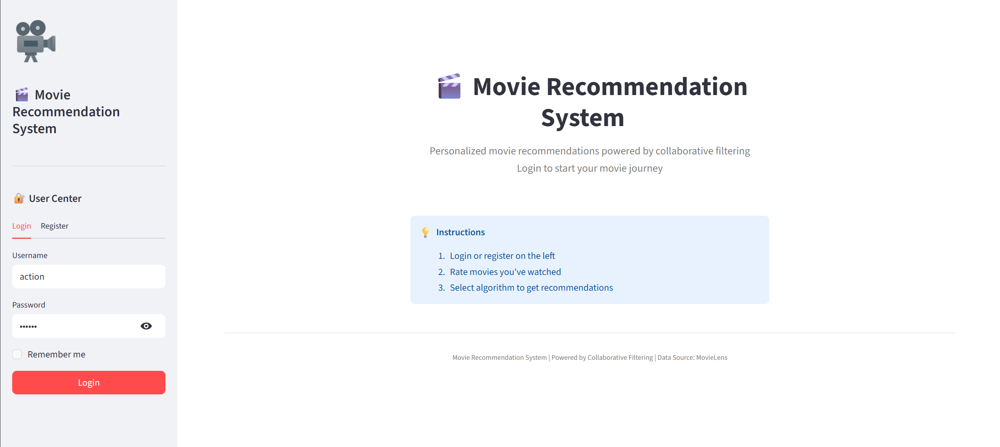
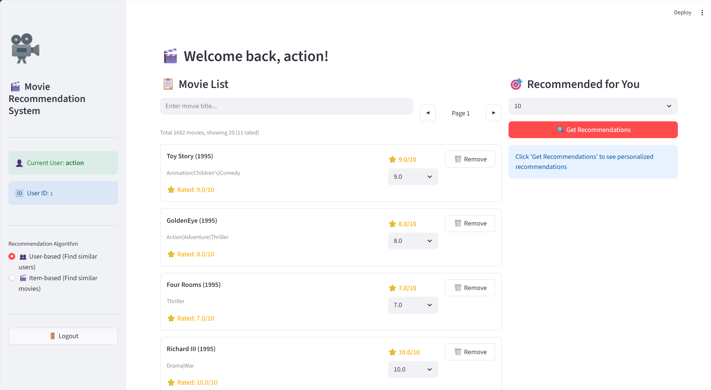

# Artefacts and References

## Artefacts

### Source Code Repository

The complete source code of the Movie Recommendation System is hosted on GitHub and is publicly accessible.

**Repository URL:** https://github.com/Zhantubirth/Movie-Recommendation.git

The repository contains the following key artefacts:

| Directory / File | Description |
|------------------|-------------|
| `/backend` | FastAPI backend source code (routers, models, database config) |
| `/algorithm` | Implementation of User-based and Item-based collaborative filtering |
| `/frontend` | Streamlit frontend application |
| `/scripts` | Data import scripts (movies, ratings) |
| `/data` | Dataset directory (MovieLens 100k - each member downloads separately) |
| `/docs/screenshots` | System demonstration screenshots |
| `requirements.txt` | Python dependencies list |
| `README.md` | Project documentation with setup instructions and team workflow |

### README

The repository includes a comprehensive `README.md` file that documents:

- Project structure and module responsibilities
- Environment setup instructions (virtual environment, dependencies)
- Git workflow and branch strategy (main, backend, frontend, algorithm)
- Dataset download instructions (MovieLens 100k)
- How to run the backend and frontend
- Common troubleshooting tips
- Screenshots of key system features

### Commit History

The development process is fully recorded in the Git commit history. The commit log shows:

- Feature additions (e.g., "feat: implement user-based CF")
- Bug fixes (e.g., "fix: exclude already-rated movies")
- Performance optimizations (e.g., "perf: add similarity threshold")
- Documentation updates (e.g., "docs: update README")

**View commit history:** https://github.com/Zhantubirth/Movie-Recommendation/commits/main

### Demonstration Screenshots

The following screenshots demonstrate the key features of the system. All screenshots were captured from the actual running system.

#### Figure 1: User Login Interface

*Users can register a new account or log in with existing credentials.*

#### Figure 2: Movie Browsing and Rating

*Users can browse the movie list with pagination and search. Clicking the rating dropdown immediately submits the rating without an extra confirmation button.*

#### Figure 3: Rating Success Feedback

*After rating a movie, a success indicator (✓) appears, confirming the rating has been saved.*

#### Figure 4: User-based Collaborative Filtering Recommendations

*User-based CF finds users with similar taste and recommends movies they liked. The result shows action/sci-fi movies for an action fan.*

#### Figure 5: Item-based Collaborative Filtering Recommendations

*Item-based CF finds movies similar to those the user already rated. The results are genre-aligned with the user's rated movies.*

### Tests

The repository includes test artefacts:

| Test Artefact | Location | Description |
|---------------|----------|-------------|
| Functional test cases | Section 5.4 of the report | 12 test cases with 100% pass rate |
| Edge case tests | Section 5.4.2 of the report | 9 edge cases validated |
| Performance benchmarks | Section 5.3 of the report | Latency and resource usage measurements |
| Algorithm comparison logs | Section 5.7.2 of the report | v0.9.0 vs v1.0.0 metrics |

### Artefacts Summary Checklist

| Artefact | Status | Location |
|----------|--------|----------|
| Source code | ✅ Available | GitHub repository |
| README | ✅ Available | Repository root |
| Commit history | ✅ Available | GitHub commits page |
| Screenshots | ✅ Available | `/docs/screenshots/` |
| Tests | ✅ Documented | Report Section 5.4 |
| Performance logs | ✅ Documented | Report Section 5.3 |
| Algorithm comparison | ✅ Documented | Report Section 5.7.2 |

---

## References

### Dataset

GroupLens Research. (1998). *MovieLens 100K Dataset*. University of Minnesota.  
https://grouplens.org/datasets/movielens/100k/

### Libraries and Frameworks

FastAPI. (2024). *FastAPI framework documentation*. https://fastapi.tiangolo.com/

Peewee. (2024). *Peewee ORM documentation*. http://docs.peewee-orm.com/

Streamlit. (2024). *Streamlit documentation*. https://docs.streamlit.io/

scikit-learn. (2024). *scikit-learn: Machine Learning in Python*. https://scikit-learn.org/

pandas. (2024). *pandas: Python Data Analysis Library*. https://pandas.pydata.org/

NumPy. (2024). *NumPy documentation*. https://numpy.org/doc/

Uvicorn. (2024). *Uvicorn documentation*. https://www.uvicorn.org/

Pydantic. (2024). *Pydantic documentation*. https://docs.pydantic.dev/

### Algorithms and Collaborative Filtering

Breese, J. S., Heckerman, D., & Kadie, C. (1998). Empirical analysis of predictive algorithms for collaborative filtering. In *Proceedings of the Fourteenth Conference on Uncertainty in Artificial Intelligence* (pp. 43-52). Morgan Kaufmann Publishers.

Sarwar, B., Karypis, G., Konstan, J., & Riedl, J. (2001). Item-based collaborative filtering recommendation algorithms. In *Proceedings of the 10th international conference on World Wide Web* (pp. 285-295). ACM.

Koren, Y., Bell, R., & Volinsky, C. (2009). Matrix factorization techniques for recommender systems. *Computer*, 42(8), 30-37. IEEE.

### Evaluation Metrics

Herlocker, J. L., Konstan, J. A., Terveen, L. G., & Riedl, J. T. (2004). Evaluating collaborative filtering recommender systems. *ACM Transactions on Information Systems*, 22(1), 5-53.

### Citation Style

All references follow the **APA 7th Edition** format.

---

*End of Artefacts and References*