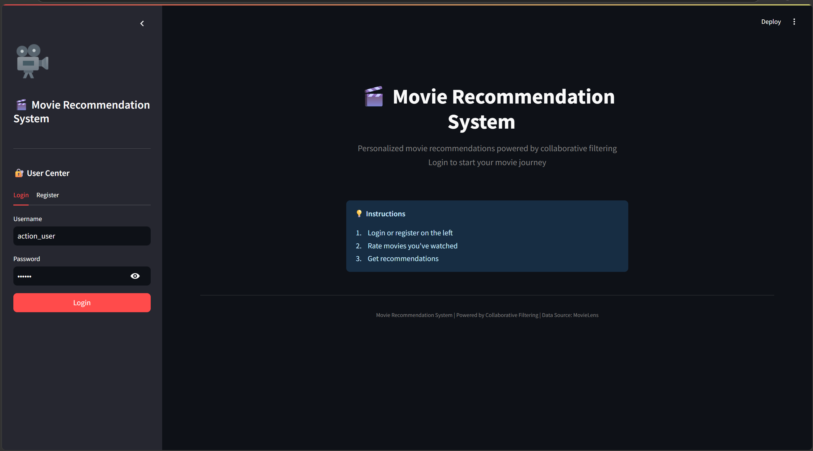
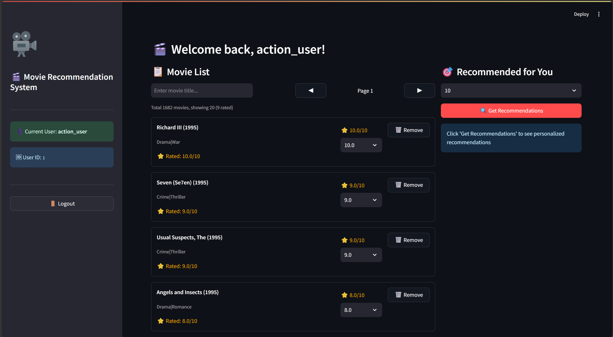

# Artefacts and References

## Artefacts

### Source Code Repository

The complete source code of the Movie Recommendation System is hosted on GitHub and is publicly accessible.

**Repository URL:** https://github.com/Zhantubirth/Movie-Recommendation.git

The repository contains the following key artefacts:

| Directory / File | Description |
|------------------|-------------|
| `/backend` | FastAPI backend source code, including user, movie, rating, and recommendation routers |
| `/algorithm` | Item-based collaborative filtering implementation and recommendation data utilities |
| `/frontend` | Streamlit frontend application with login, registration, movie browsing, rating, and recommendation views |
| `/scripts` | Data import script for MovieLens movie metadata |
| `/docs/screenshots` | System demonstration screenshots captured from the running application |
| `requirements.txt` | Python dependency list required to run the current system |
| `README.md` | Project documentation with artefacts, setup notes, feature summary, and references |

### README

The repository includes a comprehensive `README.md` file that documents:

- Project structure and module responsibilities
- Environment setup instructions
- Dataset download and import notes for MovieLens 100K
- How to run the FastAPI backend and Streamlit frontend
- Current backend API endpoints
- Current frontend features, including saved login credentials
- Screenshots of key system features
- Common references used by the project

### Current Version Summary

The current version updates the original project documentation to match the latest codebase. The main implementation state is:

- The backend exposes user, movie, rating, and recommendation APIs through FastAPI.
- The recommendation route uses the item-based collaborative filtering implementation in `algorithm/item_based.py`.
- The frontend is implemented with Streamlit and calls the backend through `requests`.
- Login credentials can be saved locally in `frontend/user_credentials.json`.
- The frontend remembers the most recently used login name through the `__last_login_username` field.
- The movie list supports search, pagination, rating submission, and rated-movie prioritisation.
- Recommendation cache data can be refreshed through the backend refresh endpoint.
- The dependency file has been reduced to the core packages required by the project.

### Setup and Running Notes

Create and activate a Python virtual environment:

```bash
python -m venv .venv
.venv\Scripts\activate
```

Install dependencies:

```bash
pip install -r requirements.txt
```

Download the MovieLens 100K dataset from:

https://grouplens.org/datasets/movielens/100k/

After extracting the dataset, update the local path in `scripts/import_movies.py` so that `DATA_PATH` points to the local `u.item` file:

```python
DATA_PATH = r"C:\Users\your-name\Desktop\ml-100k\ml-100k\u.item"
```

Import movie data:

```bash
python scripts/import_movies.py
```

Run the backend:

```bash
uvicorn backend.app.main:app --reload
```

The backend runs at:

```text
http://127.0.0.1:8000
```

The API documentation is available at:

```text
http://127.0.0.1:8000/docs
```

Run the frontend:

```bash
streamlit run frontend/app.py
```

The frontend runs at:

```text
http://localhost:8501
```

### Backend API Artefacts

The backend currently provides the following main API endpoints:

| Feature | Method | Endpoint |
|---------|--------|----------|
| User registration | POST | `/api/user/register` |
| User login | POST | `/api/user/login` |
| Movie list and search | GET | `/api/movies` |
| Movie detail | GET | `/api/movies/{movie_id}` |
| Create or update rating | POST | `/api/ratings` |
| Get user ratings | GET | `/api/ratings/{user_id}` |
| Delete rating | DELETE | `/api/ratings/{user_id}/{movie_id}` |
| Get recommendations | GET | `/api/recommend` |
| Refresh recommendation cache | POST | `/api/recommend/refresh` |

Recommendation endpoint example:

```text
GET /api/recommend?user_id=1&top_n=10
```

### Demonstration Screenshots

The following screenshots demonstrate the key features of the system. All screenshots were captured from the actual running system.

#### Figure 1: User Login Interface



*Users can register a new account or log in with existing credentials.*

#### Figure 2: Movie Browsing and Rating



*Users can browse the movie list with pagination and search. Rated movies are prioritised in the list, and users can submit or update ratings directly from the interface.*

#### Figure 3: Rating Success Feedback


*After rating a movie, the interface displays feedback confirming that the rating has been saved.*

### Tests

The repository includes documented test artefacts and manually verified behaviours:

| Test Artefact | Location | Description |
|---------------|----------|-------------|
| Functional test cases | Project report | User login, registration, movie browsing, rating, and recommendation workflows |
| Edge case tests | Project report | Empty input, invalid login, missing dataset path, and empty recommendation cases |
| API verification | FastAPI docs | Backend endpoints can be checked through `/docs` |
| UI verification | Streamlit app | Frontend workflows are verified through the running Streamlit interface |
| Screenshot evidence | `/docs/screenshots/` | Screenshots show the actual running system |

### Artefacts Summary Checklist

| Artefact | Status | Location |
|----------|--------|----------|
| Source code | Available | GitHub repository |
| README | Available | Repository root |
| Backend API | Available | `/backend/app/routers/` |
| Recommendation algorithm | Available | `/algorithm/item_based.py` |
| Frontend application | Available | `/frontend/app.py` |
| Screenshots | Available | `/docs/screenshots/` |
| Dependency list | Available | `requirements.txt` |
| Data import script | Available | `/scripts/import_movies.py` |

---

## References

### Dataset

GroupLens Research. (1998). *MovieLens 100K Dataset*. University of Minnesota.  
https://grouplens.org/datasets/movielens/100k/

### Libraries and Frameworks

FastAPI. (2024). *FastAPI framework documentation*. https://fastapi.tiangolo.com/

Peewee. (2024). *Peewee ORM documentation*. http://docs.peewee-orm.com/

Streamlit. (2024). *Streamlit documentation*. https://docs.streamlit.io/

scikit-learn. (2024). *scikit-learn: Machine Learning in Python*. https://scikit-learn.org/

pandas. (2024). *pandas: Python Data Analysis Library*. https://pandas.pydata.org/

NumPy. (2024). *NumPy documentation*. https://numpy.org/doc/

Uvicorn. (2024). *Uvicorn documentation*. https://www.uvicorn.org/

Pydantic. (2024). *Pydantic documentation*. https://docs.pydantic.dev/

Requests. (2024). *Requests documentation*. https://requests.readthedocs.io/

### Algorithms and Collaborative Filtering

Sarwar, B., Karypis, G., Konstan, J., & Riedl, J. (2001). Item-based collaborative filtering recommendation algorithms. In *Proceedings of the 10th international conference on World Wide Web* (pp. 285-295). ACM.

Breese, J. S., Heckerman, D., & Kadie, C. (1998). Empirical analysis of predictive algorithms for collaborative filtering. In *Proceedings of the Fourteenth Conference on Uncertainty in Artificial Intelligence* (pp. 43-52). Morgan Kaufmann Publishers.

Herlocker, J. L., Konstan, J. A., Terveen, L. G., & Riedl, J. T. (2004). Evaluating collaborative filtering recommender systems. *ACM Transactions on Information Systems*, 22(1), 5-53.

### Citation Style

All references follow the **APA 7th Edition** format.

---

*End of Artefacts and References*
